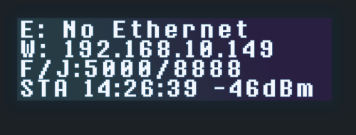

 

  

# Waveshare UGV Robots
This is a Raspberry Pi example for the [Waveshare](https://www.waveshare.com/) UGV robots: **WAVE ROVER**, **UGV Rover**, **UGV Beast**, **RaspRover**, **UGV01**, **UGV02**.  

## Basic Description
The Waveshare UGV robots utilize both an upper computer and a lower computer. This repository contains the program running on the upper computer, which is typically a Raspberry Pi in this setup.  

The program running on the lower computer is either named [ugv_base_ros](https://github.com/effectsmachine/ugv_base_ros.git) or [ugv_base_general](https://github.com/effectsmachine/ugv_base_general.git) depending on the type of robot driver being used.  

The upper computer communicates with the lower computer (the robot's driver based on ESP32) by sending JSON commands via GPIO UART. The host controller, which employs a Raspberry Pi, handles AI vision and strategy planning, while the sub-controller, utilizing an ESP32, manages motion control and sensor data processing. This setup ensures efficient collaboration and enhanced performance.

## Features
- Real-time video based on WebRTC
- Interactive tutorial based on JupyterLab
- Pan-tilt camera control
- Robotic arm control
- Cross-platform web application base on Flask
- Auto targeting (OpenCV)
- Object Recognition (OpenCV)
- Gesture Recognition (MediaPipe)
- Face detection (OpenCV & MediaPipe)
- Motion detection (OpenCV)
- Line tracking base on vision (OpenCV)
- Color Recognition (OpenCV)
- Multi-threaded CV processing
- Audio interactive
- Shortcut key control
- Photo taking
- Video Recording

## Quick Install
You need to install Raspberry Pi on your robot if you are using **WAVE ROVER**, **UGV01** or **UGV02**.  

This app is already installed in the SD card of **UGV Rover**, **UGV Beast** and **RaspRover**.  

You can use this tutorial to upgrade your robot's upper computer program.  

You can use this tutorial to install this program on a pure Raspberry Pi OS.  

### Download the repo from github

You can clone this repository from Waveshare's GitHub to your local machine.

    git clone https://github.com/waveshareteam/ugv_rpi.git
    
### Grant execution permission to the installation script
    cd ugv_rpi/
    sudo chmod +x setup.sh
    sudo chmod +x autorun.sh
### Install app (it'll take a while before finish)
    sudo ./setup.sh
### Autorun setup
    ./autorun.sh
### AccessPopup installation
    cd AccessPopup
    sudo chmod +x installconfig.sh
    sudo ./installconfig.sh
    *Input 1: Install AccessPopup
    *Press any key to exit
    *Input 9: Exit installconfig.sh
### Reboot Device
    sudo reboot

After powering on the robot, the Raspberry Pi will automatically establish a hotspot, and the LED screen will display a series of system initialization messages:  

- The first line `E` displays the IP address of the Ethernet port, which allows remote access to the Raspberry Pi. If it shows No Ethernet, it indicates that the Raspberry Pi is not connected to an Ethernet cable.
- The second line `W` indicates the robot's wireless mode. In Access Point (AP) mode, the robot automatically sets up a hotspot with the default IP address `192.168.50.5`. In Station (STA) mode, the Raspberry Pi connects to a known WiFi network and displays the IP address for remote access.
- The third line `F/J` specifies the Ethernet port numbers. Port `5000` provides access to the robot control Web UI, while port `8888` grants access to the JupyterLab interface.
- The fourth line `STA` indicates that the WiFi is in Station (STA) mode. The time value represents the duration of robot usage. The dBm value indicates the signal strength RSSI in STA mode.  

You can access the robot web app using a mobile phone or PC. Simply open your browser and enter `[IP]:5000` (for example, `192.168.10.50:5000`) in the URL bar to control the robot.  

To access JupyterLab, use `[IP]:8888` (for example, `192.168.10.50:8888`).  

If the robot is not connected to a known WiFi network, it will automatically set up a hotspot named "`AccessPopup`" with the password `1234567890`. You can then use a mobile phone or PC to connect to this hotspot. Once connected, open your browser and enter `192.168.50.5:5000` in the URL bar to control the robot.  

To ensure compatibility with various types of robots running on Raspberry Pi, we utilize a config.yaml file to specify the particular robot being used. You can configure the robot by entering the following command:

    s 22

In this command, the s directive denotes a robot-type setting. The first digit, `2`, signifies that the robot is a `UGV Rover`, with `1` representing `RaspRover` and `3` indicating `UGV Beast`. The second digit, also `2`, specifies the module as `Camera PT`, where `0` denotes `Nothing` and `1` signifies `RoArm-M2`.  

### Reboot Device
If the program fails to run and encounters errors related to v4l2.py during runtime, you need to delete v4l2.py from both the Python virtual environment and the user environment. This will allow the program to automatically use the system-wide v4l2.py.  

    cd ugv_rpi/  
    sudo rm ugv-env/lib/python3.11/site-packages/v4l2.py  
    sudo rm /home/[your_user_name]/.local/lib/python3.11/site-packages/v4l2.py  

Now you can restart the main program app.py.

# License
ugv_rpi for the Raspberry Pi: an open source robotics platform for the Raspberry Pi.
Copyright (C) 2024 [Waveshare](https://www.waveshare.com/)

This program is free software: you can redistribute it and/or modify
it under the terms of the GNU General Public License as published by
the Free Software Foundation, either version 3 of the License, or
(at your option) any later version.

This program is distributed in the hope that it will be useful,
but WITHOUT ANY WARRANTY; without even the implied warranty of
MERCHANTABILITY or FITNESS FOR A PARTICULAR PURPOSE.  See the
GNU General Public License for more details.

You should have received a copy of the GNU General Public License
along with this program.  If not, see <http://www.gnu.org/licenses/gpl-3.0.txt>.
